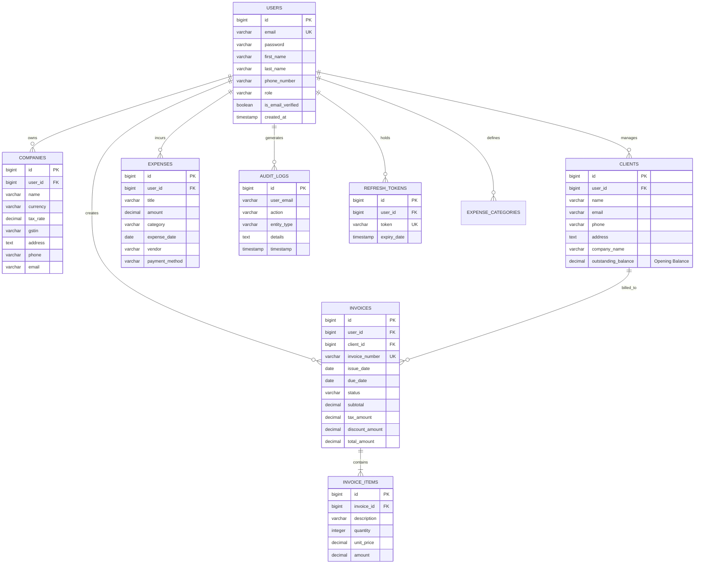
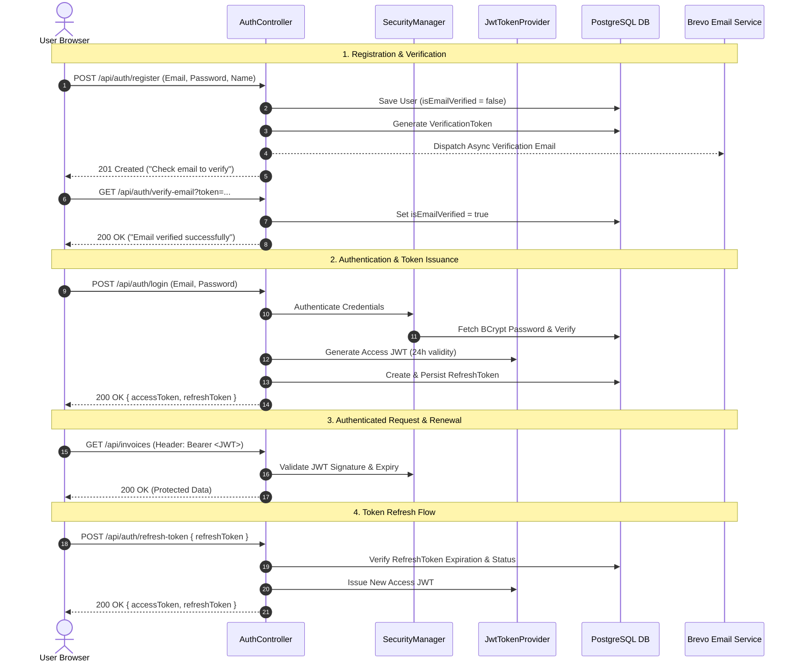
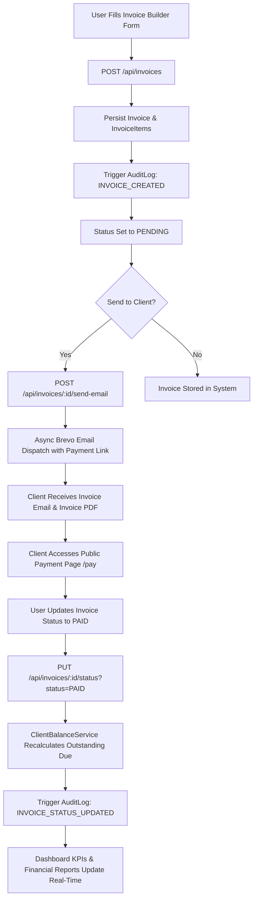

# SmartLedger

<div align="center">

```
   _____                 ____  __               __                 
  / ___/____ ___  ____ _/ __ \/ /_  ___  ____ _/ /___  __________ 
  \__ \/ __ `__ \/ __ `/ /_/ / / / / _ \/ __ `/ / __ \/ ___/ ___/ 
 ___/ / / / / / / /_/ / _, _/ / /_/  __/ /_/ / / /_/ / /  / /     
/____/_/ /_/ /_/\__,_/_/ |_/_/_____/\___/\__,_/_/\____/_/  /_/      
```

### **Bank-Grade Financial Operating System & Autonomous Accounting Intelligence**

[](https://smartledger-five.vercel.app)
[](LICENSE)
[](https://spring.io/projects/spring-boot)
[](https://react.dev/)
[](https://www.typescriptlang.org/)
[](https://www.postgresql.org/)

---

</div>

## Table of Contents

- [Overview](#overview)
- [Live Demo](#live-demo)
- [Key Features](#key-features)
- [Tech Stack](#tech-stack)
- [System Architecture](#system-architecture)
- [Project Structure](#project-structure)
- [Database Design](#database-design)
- [Authentication Flow](#authentication-flow)
- [Invoice Lifecycle & Accounting Engine](#invoice-lifecycle--accounting-engine)
- [Screenshots](#screenshots)
- [API Documentation](#api-documentation)
- [Installation & Setup](#installation--setup)
- [Environment Variables](#environment-variables)
- [Security Engineering](#security-engineering)
- [Performance & Optimization](#performance--optimization)
- [Future Improvements](#future-improvements)
- [Resume Highlights](#resume-highlights)
- [Interview Discussion Topics](#interview-discussion-topics)
- [License](#license)
- [Author](#author)

---

## Overview

**SmartLedger** is a full-stack, enterprise-grade financial management platform and autonomous ledger system designed for modern SMBs, freelancers, and growing accounting teams. It bridges the gap between complex double-entry accounting software and intuitive cloud invoicing by offering real-time cash flow tracking, automated invoice generation, client balance ledgers, expense classification, and AI-driven CFO executive advisory.

Built to solve the operational friction of manual book-keeping, missing receipts, and delayed client payments, SmartLedger implements standard real-world accounting rules. Outstanding client balances dynamically account for opening balances, pending invoices, and payment settlements. An integrated Gemini AI Executive Copilot analyzes transaction patterns in real time to generate executive health scores, risk assessments, and actionable capital allocation advisories.

SmartLedger was architected with a production-first mindset—featuring asynchronous email dispatch via Brevo, robust multi-tenant data isolation at the database layer, JWT authentication with refresh token rotators, complete audit trails, and strict TypeScript/Java type safety.

---

## Live Demo

- **Frontend Application (Vercel)**: [https://smartledger-five.vercel.app](https://smartledger-five.vercel.app)
- **GitHub Repository**: [https://github.com/Arnavnandi/smartledger](https://github.com/Arnavnandi/smartledger)

> **Test Credentials**: You can register a new account instantly with email verification, or use the pre-configured workspace for testing.

---

## Key Features

### Authentication & Access Control
- **Stateless JWT Authentication**: Secure 24-hour JSON Web Tokens signed with HMAC-SHA256.
- **Refresh Token Rotation**: Persistent refresh token storage in database with automated revocation upon logout.
- **Email Verification Flow**: Automated account activation token emails dispatched asynchronously upon user registration.
- **Async Password Reset**: Non-blocking password reset token generation and Brevo API email delivery under 200ms client response time.
- **BCrypt Password Encryption**: Safe key-stretching password hashing (`BCryptPasswordEncoder`).
- **Role-Based Access Control (RBAC)**: Enforced `ROLE_USER` and `ROLE_ADMIN` route guards across frontend layouts and backend Spring Security filters.

### Client Management & Accounting
- **Client Directory**: Complete CRM contact records with company details, GSTIN/tax IDs, email, address, and notes.
- **Accrual Accounting Opening Balances**: Support for historical opening balances (`Opening Balance`) owed by clients prior to onboarding.
- **Real-Time Outstanding Due Calculation**: Dynamic formula $\text{Outstanding Due} = \text{Opening Balance} + \sum(\text{Unpaid Invoices})$ matching industry accounting software (Zoho Books, QuickBooks).
- **Client Activity Logs**: Automatic audit trail mapping of invoice creation, payment status updates, and profile edits scoped per user.

### Invoice Management & Automation
- **Custom Invoice Builder**: Line-item builder with dynamic calculation of subtotal, percentage discounts, GST/tax rates, and net total.
- **Instant PDF Generation & Download**: Client-side and server-side PDF document compilation with custom brand colors and company logos.
- **Automated Client Email Dispatch**: One-click async invoice delivery with embedded HTML email templates containing direct payment links.
- **Status Lifecycle Control**: Mark invoices as `DRAFT`, `PENDING`, `PAID`, `OVERDUE`, or `CANCELLED` with transactional balance recalculation.
- **Public Payment Interface**: Public payment portal page (`/pay?invoiceId=...`) enabling clients to view details and settle invoices.

### Expense Management & Receipt Parsing
- **Categorized Expense Tracker**: Record business expenses categorized by customizable categories (Marketing, Operations, Software, Travel, Payroll).
- **Vendor & Payment Method Auditing**: Track payment modes (UPI, Credit Card, Bank Transfer, Cash) and vendor invoice reference numbers.
- **Receipt Image Attachment**: Store and link uploaded receipt receipts and invoices.
- **Recurring Expenses**: Support for automated recurring expenses (Monthly, Weekly, Yearly).

### AI Financial Copilot (Gemini API Integration)
- **Autonomous Financial Health Scoring**: Gemini 2.5 Flash API evaluates revenue-to-expense ratios, cash flow velocity, and pending collections to generate a 0–100 health score.
- **Executive Advisory Insights**: Identifies top risk factors (e.g. high pending dues, expense spikes) and provides recommended strategic growth actions.
- **Smart AI Receipt Parser**: Automatically extracts total amount, vendor name, expense category, and transaction date from receipt images via Gemini Vision.

### Analytics, Reports & Audit Logs
- **Interactive Financial Dashboard**: Real-time KPI summary widgets (Total Revenue, Total Expenses, Net Profit, Pending Payments) with animated counters.
- **Multi-Format Export Engine**: Export financial summaries to styled PDF reports or Microsoft Excel (`.xlsx`) workbooks.
- **Multi-User Isolated Activity Log**: Granular audit logging (`USER_REGISTERED`, `INVOICE_CREATED`, `INVOICE_STATUS_UPDATED`, `EXPENSE_CREATED`, etc.) strictly isolated per authenticated user ID.
- **Real-Time Notification System**: Unread notification counter and dropdown list for system alerts.

---

## Tech Stack

### Backend


### Frontend


### Database & Security


### Integrations & Services


### DevOps & Deployment


---

## System Architecture

```mermaid
graph TD
    Client[Client Browser / Desktop / Mobile] -->|HTTPS Requests| Frontend[React 19 + TypeScript + Vite SPA]
    
    subgraph Frontend Layer
        Frontend --> AuthCtx[Auth Context & JWT Store]
        Frontend --> APIClient[Axios Interceptor + Bearer Token]
    />
    
    APIClient -->|REST API / Json| SpringBoot[Spring Boot 3.4 Backend Server]

    subgraph Spring Boot Application Server
        SpringBoot --> SecFilter[Spring Security Filter Chain]
        SecFilter --> JWTFilter[JwtAuthenticationFilter]
        JWTFilter --> Controllers[REST Controllers]
        
        Controllers --> Services[Business Logic Services]
        
        Services --> BalanceSvc[ClientBalanceService]
        Services --> AuditSvc[AuditLogService]
        Services --> AsyncEmail[Async Email Service @Async]
        Services --> AISvc[Gemini AI Advisory Service]
        
        Services --> Repositories[Spring Data JPA Repositories]
    end

    subgraph External Integrations
        AsyncEmail -->|HTTPS API| Brevo[Brevo Transactional Email API]
        AISvc -->|HTTPS API| Gemini[Google Gemini 2.5 Flash AI API]
    end

    subgraph Database Layer
        Repositories -->|JDBC / SQL| Postgres[(PostgreSQL 15 Database)]
    end
```

---

## Project Structure

```
SmartLedger/
├── backend/
│   ├── src/
│   │   ├── main/
│   │   │   ├── java/com/smartledger/
│   │   │   │   ├── config/              # Security, CORS, Swagger, & Async Configurations
│   │   │   │   ├── controller/          # REST Endpoints (Auth, Invoice, Client, Expense, AI, etc.)
│   │   │   │   ├── exception/           # GlobalExceptionHandler & Custom Error Schemas
│   │   │   │   ├── model/               # JPA Entities (User, Invoice, Client, Expense, AuditLog, etc.)
│   │   │   │   │   └── dto/             # Request & Response Data Transfer Objects
│   │   │   │   ├── repository/          # Spring Data JPA Interfaces
│   │   │   │   ├── security/            # JwtTokenProvider, UserDetailsService, & Custom Filters
│   │   │   │   └── service/             # Core Business Logic & External API Integrations
│   │   │   └── resources/
│   │   │       ├── application.yml      # Base Spring Boot Configuration
│   │   │       └── application-prod.yml # Production Environment Properties
│   ├── Dockerfile                       # Multi-stage Maven/JDK Build Configuration
│   └── pom.xml                          # Maven Dependency Manifest
├── frontend/
│   ├── src/
│   │   ├── components/
│   │   │   ├── shared/                  # Reusable UI (Breadcrumbs, ThemeToggle, CommandPalette)
│   │   │   └── ui/                      # Base UI Design Tokens (Button, Card, Dialog, Dropdown)
│   │   ├── context/                     # Global State Providers (AuthContext, CompanyContext)
│   │   ├── layouts/                     # Master Layout Wrapper (DashboardLayout, AdminLayout)
│   │   ├── pages/                       # Application Views
│   │   │   ├── activity/                # Audit Trail Log Viewer
│   │   │   ├── admin/                   # Super Admin Management Console
│   │   │   ├── auth/                    # Login, Register, Forgot Password, Reset Password
│   │   │   ├── clients/                 # Client Directory, Add Client, Client Details
│   │   │   ├── dashboard/               # Financial Overview & Profile Settings
│   │   │   ├── expenses/                # Expense List & Expense Entry Form
│   │   │   ├── invoices/                # Invoice List, Builder, & PDF Preview
│   │   │   └── reports/                 # Financial Summary & Excel/PDF Exporters
│   │   ├── services/                    # Axios API Handlers
│   │   └── types/                       # TypeScript Interface Definitions
│   ├── package.json                     # Node.js Dependencies Manifest
│   └── vite.config.ts                   # Vite Build Settings & Proxy Rules
├── docker-compose.yml                   # Multi-container Compose Orchestration Manifest
└── README.md                            # Open Source Technical Documentation
```

---

## Database Design



---

## Authentication Flow



---

## Invoice Lifecycle & Accounting Engine



---

## Screenshots

<div align="center">

| Section | Preview | Caption |
| :--- | :---: | :--- |
| **Financial Dashboard** |  | Real-time financial metrics, cash flow dynamics, and Gemini AI CFO Copilot advisory. |
| **Invoice Builder** |  | Custom line-item builder with dynamic tax/discount calculations and instantaneous PDF preview. |
| **Client Directory** |  | Accrual accounting ledger displaying client opening balances and real-time outstanding dues. |
| **Expense Management** |  | Categorized expense tracking, vendor auditing, and Gemini AI visual receipt image parsing. |
| **Financial Reports** |  | Analytics breakdown with export support for downloadable PDF summaries and Excel workbooks. |
| **My Profile** |  | Personal details, client contact support number, and BCrypt security password update. |
| **Activity Log** |  | User-isolated enterprise audit trail tracking authentication, document mutations, and state changes. |

</div>

---

## API Documentation

### Authentication & User Endpoints (`/api/auth`, `/api/users`)

| Method | Endpoint | Description | Access Control |
| :--- | :--- | :--- | :--- |
| `POST` | `/api/auth/register` | Register a new business user account | Public |
| `POST` | `/api/auth/login` | Authenticate credentials & return JWT + Refresh Token | Public |
| `GET` | `/api/auth/verify-email` | Verify user email via token sent during registration | Public |
| `POST` | `/api/auth/refresh-token` | Exchange valid Refresh Token for a fresh Access JWT | Public |
| `POST` | `/api/auth/forgot-password` | Initiate async password reset email dispatch | Public |
| `POST` | `/api/auth/reset-password` | Reset password using valid reset token | Public |
| `POST` | `/api/auth/logout` | Revoke refresh token and terminate session | Authenticated |
| `GET` | `/api/users/profile` | Get currently authenticated user profile & contact info | Authenticated |
| `PUT` | `/api/users/profile` | Update user name and client support mobile number | Authenticated |
| `PUT` | `/api/users/change-password` | Validate current password and set new BCrypt hash | Authenticated |

### Client Directory Endpoints (`/api/clients`)

| Method | Endpoint | Description | Access Control |
| :--- | :--- | :--- | :--- |
| `GET` | `/api/clients` | Get paginated list of clients with dynamic outstanding dues | Authenticated |
| `POST` | `/api/clients` | Create client with opening balance and contact details | Authenticated |
| `GET` | `/api/clients/{id}` | Get client details, payment history, and pending invoices | Authenticated |
| `PUT` | `/api/clients/{id}` | Update client contact information or opening balance | Authenticated |
| `DELETE` | `/api/clients/{id}` | Remove client record from database | Authenticated |

### Invoice Endpoints (`/api/invoices`)

| Method | Endpoint | Description | Access Control |
| :--- | :--- | :--- | :--- |
| `GET` | `/api/invoices` | Get paginated list of invoices with status filtering | Authenticated |
| `POST` | `/api/invoices` | Create invoice with line-items, tax rates, and due date | Authenticated |
| `GET` | `/api/invoices/{id}` | Get full invoice details and line-item breakdowns | Authenticated |
| `PUT` | `/api/invoices/{id}` | Update draft or pending invoice details | Authenticated |
| `DELETE` | `/api/invoices/{id}` | Delete invoice and update client balance ledger | Authenticated |
| `POST` | `/api/invoices/{id}/send-email` | Async email invoice PDF link to client via Brevo API | Authenticated |
| `PUT` | `/api/invoices/{id}/status` | Update status (`PAID`, `PENDING`, `OVERDUE`) | Authenticated |

### Expense & Categories Endpoints (`/api/expenses`, `/api/expense-categories`)

| Method | Endpoint | Description | Access Control |
| :--- | :--- | :--- | :--- |
| `GET` | `/api/expenses` | List expenses with date range and category filters | Authenticated |
| `POST` | `/api/expenses` | Log business expense with receipt URL attachment | Authenticated |
| `DELETE` | `/api/expenses/{id}` | Delete expense entry | Authenticated |
| `GET` | `/api/expense-categories` | List user customizable expense categories | Authenticated |
| `POST` | `/api/expense-categories` | Add custom expense category with custom icon/color | Authenticated |

### AI Advisory & Parsing Endpoints (`/api/ai`)

| Method | Endpoint | Description | Access Control |
| :--- | :--- | :--- | :--- |
| `GET` | `/api/ai/financial-analysis` | Generate Gemini AI financial health score & advice | Authenticated |
| `POST` | `/api/ai/parse-receipt` | Extract expense fields from receipt image via Gemini | Authenticated |

### Analytics & System Endpoints (`/api/reports`, `/api/activity`, `/api/admin`)

| Method | Endpoint | Description | Access Control |
| :--- | :--- | :--- | :--- |
| `GET` | `/api/reports/financial-summary` | Generate financial totals & category breakdowns | Authenticated |
| `GET` | `/api/reports/export/pdf` | Stream downloadable financial report PDF | Authenticated |
| `GET` | `/api/reports/export/excel` | Stream downloadable formatted Excel workbook (`.xlsx`) | Authenticated |
| `GET` | `/api/activity` | Get user-isolated audit logs with pagination | Authenticated |
| `GET` | `/api/admin/dashboard` | Super Admin console system health & user metrics | Admin Only |

---

## Installation & Setup

### Prerequisites
- **Java JDK**: Version 17 or higher
- **Node.js**: Version 18.x or 20.x
- **PostgreSQL**: Version 15.0 or higher
- **Docker & Docker Compose** *(Optional, for containerized execution)*

---

### Method 1: Local Development Setup

#### 1. Clone the Repository
```bash
git clone https://github.com/Arnavnandi/smartledger.git
cd smartledger
```

#### 2. Configure PostgreSQL Database
Create a local PostgreSQL database named `smartledger_db`:
```sql
CREATE DATABASE smartledger_db;
CREATE USER smartledger WITH PASSWORD 'password';
GRANT ALL PRIVILEGES ON DATABASE smartledger_db TO smartledger;
```

#### 3. Setup Backend Service
Navigate to the `backend` directory, create your environment properties file, and start the application:
```bash
cd backend

# Configure environment properties
cp src/main/resources/application.yml src/main/resources/application-local.yml

# Run Spring Boot backend application
./mvnw spring-boot:run
```
The Spring Boot server will start on `http://localhost:8080`.

#### 4. Setup Frontend Application
In a new terminal window, navigate to the `frontend` directory:
```bash
cd frontend

# Install Node.js dependencies
npm install

# Start Vite development server
npm run dev
```
The React SPA will start on `http://localhost:5173`.

---

### Method 2: Docker Compose Setup

Run the entire platform (PostgreSQL Database, Spring Boot Backend, and React Frontend) with a single command:

```bash
docker-compose up --build
```

- **Frontend Application**: `http://localhost:5173`
- **Backend REST API**: `http://localhost:8080`
- **Swagger API Docs**: `http://localhost:8080/swagger-ui.html`

---

## Environment Variables

Configure the following environment variables in your environment or deployment manager (Render / Vercel):

| Variable Name | Description | Default / Example Value |
| :--- | :--- | :--- |
| `SPRING_DATASOURCE_URL` | JDBC PostgreSQL connection string | `jdbc:postgresql://localhost:5432/smartledger_db` |
| `SPRING_DATASOURCE_USERNAME` | Database username | `smartledger` |
| `SPRING_DATASOURCE_PASSWORD` | Database password | `password` |
| `JWT_SECRET` | 256-bit secret key for signing JWTs | `supersecretkeythatisatleast256bitslong...` |
| `BREVO_API_KEY` | Brevo (Sendinblue) API Key for emails | `xkeysib-xxxxxxxxxxxxxxxxx` |
| `BREVO_SENDER_EMAIL` | Sender email address for transaction emails | `noreply@yourdomain.com` |
| `BREVO_SENDER_NAME` | Display sender name for emails | `SmartLedger Billing` |
| `GEMINI_API_KEY` | Google Gemini AI API key | `AIzaSy...` |
| `GEMINI_MODEL` | Google Gemini Model version | `gemini-2.5-flash` |
| `FRONTEND_URL` | Frontend URL for email verification & reset links | `https://smartledger-five.vercel.app` |

---

## Security Engineering

SmartLedger incorporates multi-layered defense mechanisms aligning with OWASP Top 10 security standards:

1. **HMAC-SHA256 JWT Authentication**: Stateless access tokens with a 24-hour expiration window.
2. **Refresh Token Rotation & Revocation**: Refresh tokens stored in PostgreSQL with explicit expiry dates and revocation on logout.
3. **BCrypt Key-Stretching Hashing**: All user passwords are encrypted using `BCryptPasswordEncoder` before storage.
4. **Data Isolation (Multi-Tenancy)**: All queries for Clients, Invoices, Expenses, and Audit Logs are explicitly scoped to the authenticated user's ID (`SecurityContextHolder`). Users cannot inspect or mutate records belonging to another account.
5. **Rate Limiting & Brute Force Defense**: Login attempt tracking limits consecutive failed attempts per IP/account.
6. **Strict CORS Policy Configuration**: Restricts cross-origin resource sharing strictly to whitelisted frontend domain origins.
7. **Input Sanitization & Validation**: Java Bean Validation (`@Valid`, `@NotBlank`, `@Size`) prevents malformed payloads.

---

## Performance & Optimization

- **Asynchronous Execution (`@Async`)**: Password reset emails and transactional invoice notifications are dispatched asynchronously via Spring `@Async` executors, ensuring client API response times remain under **200ms**.
- **Centralized Balance Engine**: Client balance calculations use optimized JPQL aggregate queries (`SUM(i.totalAmount)` filtering unpaid statuses), eliminating race conditions and manual database mutations.
- **Database Indexing & Lazy Loading**: JPA relationships use `FetchType.LAZY` to prevent N+1 query overhead during list fetches.
- **Vite Chunk Code-Splitting**: Frontend production bundles are split into lightweight dynamic chunks (`<500kB`), keeping initial page load fast.

---

## Future Improvements

- [ ] **Multi-Tenant Organizations & Team Invites**: Enable team owners to invite sub-users (Accountants, Managers) with granular role permissions.
- [ ] **Stripe & Razorpay Payment Gateway Integration**: Webhook handlers to automatically mark invoices as `PAID` upon online payment completion.
- [ ] **Mobile Native App (React Native)**: Cross-platform iOS/Android mobile client for quick invoice generation on the go.
- [ ] **Real-Time WebSockets Push Notifications**: Push alerts for invoice views and payment updates via STOMP/WebSocket.

---

## Resume Highlights

- **Full-Stack Financial OS Architecture**: Designed and implemented a production financial accounting system handling client ledgers, automated invoicing, expense tracking, and AI advisory using Spring Boot 3 and React 19.
- **Accrual Accounting Engine**: Engineered a dynamic client balance service ($\text{Outstanding Due} = \text{Opening Balance} + \sum(\text{Unpaid Invoices})$) adhering to industry accounting rules (Zoho Books/QuickBooks).
- **Stateless JWT & Refresh Token Auth**: Built an end-to-end authentication system featuring HMAC-SHA256 JWTs, refresh token rotation, BCrypt password hashing, and Spring Security filters.
- **Async Micro-Integrations**: Integrated Brevo API with Spring `@Async` background execution to achieve **<200ms response times** for password resets and email invoice delivery.
- **AI Financial Executive Copilot**: Integrated Google Gemini 2.5 Flash API to calculate automated financial health scores (0–100) and generate strategic capital allocation advisories.
- **Multi-Tenant Data Isolation**: Implemented user-scoped database isolation and enterprise audit logging across all backend repositories and REST endpoints.
- **Multi-Format Export Pipeline**: Built automated document generation services converting raw financial datasets into formatted iText PDFs and Apache POI Excel workbooks.

---

## Interview Discussion Topics

### 1. Spring Boot Architecture & Layered Design
> *"In SmartLedger, I enforced clean separation of concerns using a 4-tier architecture: REST Controllers for HTTP payload validation, Service Layer for business transactional logic, Spring Data JPA Repositories for data access, and Domain Entities/DTOs for data transfer."*

### 2. Double-Entry Accounting Logic & Race Conditions
> *"Instead of manually mutating client balances on every invoice edit, I created `ClientBalanceService`. It computes the client's current outstanding due using database aggregate functions over opening balances and unpaid invoices. This prevents balance drifting and guarantees consistency."*

### 3. Asynchronous Email Dispatch with `@Async`
> *"Calling third-party HTTP APIs like Brevo during a web request can introduce 2–5 second delays. By annotating mail dispatch methods with `@Async` and configuring Spring's `ThreadPoolTaskExecutor`, the server stores token state and returns an immediate HTTP response to the user while mail dispatch executes in the background."*

### 4. React 19 State Management & Layout Isolation
> *"I structured the frontend layout using React Router v7 nested routes and React Context providers (`AuthContext`, `CompanyContext`). This ensures authentication tokens and company metadata are accessible globally without prop-drilling."*

---

## License

Distributed under the **MIT License**. See [`LICENSE`](LICENSE) for more information.

---

## Author

**Arnav Nandi**  
*Senior Software Engineer & Full-Stack Developer*

- **Portfolio / Live App**: [smartledger-five.vercel.app](https://smartledger-five.vercel.app)
- **GitHub**: [@Arnavnandi](https://github.com/Arnavnandi)
- **Email**: `arnavnandi12@gmail.com`

---

<div align="center">
  <sub>Built with ❤️ using Spring Boot 3, React 19, PostgreSQL, and Google Gemini AI.</sub>
</div>
